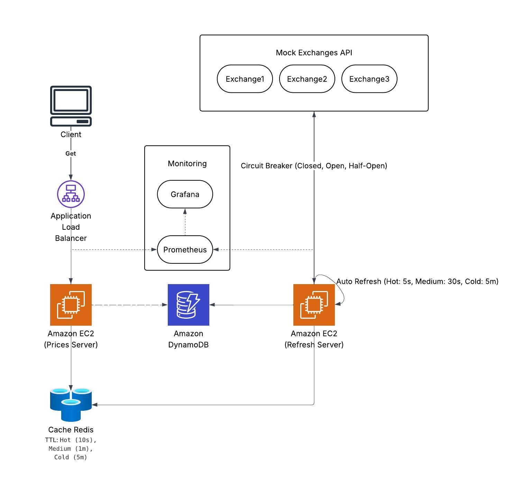
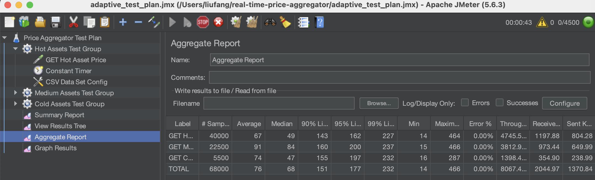
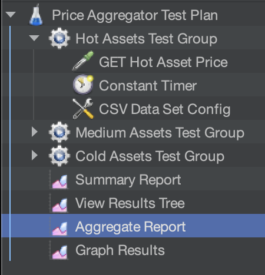

# Real-Time Price Aggregator

A scalable system aggregating real-time financial asset prices from multiple platforms, optimized for low latency and high availability under high concurrency.

## Table of Contents
- [Project Overview](#project-overview)
- [System Architecture](#system-architecture)
- [Tech Stack](#tech-stack)
- [Performance Goals & Results](#performance-goals--results)
- [Design Trade-offs](#design-trade-offs)
- [How to Deploy](#how-to-deploy)
- [API Design](#api-design)
- [Testing the System](#testing-the-system)
- [Project Structure](#project-structure)
- [Future Work](#future-work)
- [License](#license)

## Project Overview

This system fetches prices for financial assets (e.g., BTC, ETH) from multiple mock APIs, caches the latest data in Redis, and provides users with the aggregated price in real time using a weighted average based on trading volume. Historical price data is stored in DynamoDB for persistence.

**Key Features:**
- Efficient multi-source API data fetching
- Redis for real-time price caching with tier-specific TTLs
- DynamoDB for historical price storage
- Fault-tolerant with circuit breaker pattern
- Prometheus + Grafana for comprehensive system metrics
- Tiered automatic refresh based on asset popularity
- Supports a large asset pool

**Key Implementation:**
- `GET /prices/{asset}` retrieves prices directly from Redis cache with fallback to DynamoDB
- Assets are validated against a predefined list in `symbols.csv` (1000 assets)
- Automatic tiered refresh mechanism:
  - Hot assets (top 20): Every 5 seconds
  - Medium assets (next 180): Every 30 seconds
  - Cold assets (remaining 800): Every 5 minutes
- Manual `POST /refresh/{asset}` for on-demand price refresh

## System Architecture



### Mock Exchanges
The system simulates three exchanges to mimic real-world trading platforms:
- **Exchange 1**: Runs on `http://localhost:8081/mock/ticker/{symbol}`
- **Exchange 2**: Runs on `http://localhost:8082/mock/ticker/{symbol}`
- **Exchange 3**: Runs on `http://localhost:8083/mock/ticker/{symbol}`

Each exchange supports 1000 assets defined in `symbols.csv` and provides mock price and timestamp data.

### Data Flow
1. The refresher service automatically fetches price data from the three mock exchanges at intervals based on asset tier.
2. Prices are stored in Redis (cache) and DynamoDB (persistent storage).
3. Users query the aggregated price via `GET /prices/{asset}`, which retrieves data from Redis.
4. For cold tier assets or cache misses, the system can force a refresh to ensure fresh data.

### Data Structure
#### DynamoDB Table
- **Table Name**: `prices`
- **Structure**:

| Field Name  | Type   | Description                  | Example Value  |
|-------------|--------|------------------------------|----------------|
| asset       | String | Partition key, asset symbol  | BTCUSDT        |
| timestamp   | Number | Sort key, exchange timestamp | 1696118400     |
| price       | Number | Weighted average price       | 79450.12       |
| updated_at  | Number | Record update time (system)  | 1696118405     |

**Note**: The table is automatically created when the server starts, using code in `internal/storage/dynamodb.go`.

## Tech Stack
- **Backend**: Go (microservices)
- **Cache**: Redis
- **Database**: DynamoDB (via AWS DynamoDB)
- **Monitoring**: Prometheus + Grafana
- **Testing**: Apache JMeter (for load and latency testing)
- **Deployment**: Docker Compose (local), Terraform (AWS)

## Performance Goals & Results

### Performance Targets
- **Latency**: 
  - P95 (95th percentile) GET request: < 80ms
  - P99 (99th percentile) GET request: < 100ms
- **Throughput**: 1000+ requests/second
- **API error rate**: < 0.1%
- **CPU usage**: < 70%
- **Memory usage**: < 80%
- **Redis cache hit rate**: > 95%

### Achieved Performance

| Metric            | Target       | Achieved       |
|-------------------|--------------|----------------|
| P95 Latency       | < 80ms       | Met            |
| P99 Latency       | < 100ms      | Met            |
| Throughput        | 1000+ req/s  | ~8000 req/s    |
| Cache Hit Rate    | > 95%        | ~100%          |



## Design Trade-offs
- **Lambda vs. EC2 for Automatic Refreshes**: 
  - Considered using AWS Lambda for POST/refresh operations
  - Rejected due to CloudWatch's minimum interval of 1 minute (incompatible with 5s/30s refresh requirements) and cost considerations
  - Implemented using Go tickers on EC2 instances instead
  - The EC2 solution is more suitable for current needs in terms of cost and real-time performance.

- **Auto Scaling Group Implementation**:
  - Considered implementing ASG for dynamic scaling
  - Postponed due to system not yet reaching consistent bottlenecks and implementation complexity

- **Kafka Integration**:
  - Considered using Kafka for decoupling components
  - Rejected due to potential data freshness issues when users request real-time prices
  - The Redis/DynamoDB solution proved sufficient for current scale

- **Throughput vs. Latency**:
  - Current system configuration balances throughput and latency
  - Primary optimization target is response time, with throughput as secondary consideration

## How to Deploy

### Prerequisites
1. Install [Docker](https://docs.docker.com/get-docker/) and [Docker Compose](https://docs.docker.com/compose/install/).
2. Install [Go](https://golang.org/doc/install) (version 1.23 or later) for local development (optional if using Docker).
3. Install `redis-cli` for testing:
   - On macOS: `brew install redis`
   - On Ubuntu: `sudo apt-get install redis-tools`
   - On Windows (WSL): `sudo apt-get install redis-tools`
4. Install `aws` CLI for interacting with Localstack:
   - Follow instructions at [AWS CLI Installation](https://aws.amazon.com/cli/).
   - On macOS: `brew install awscli`
5. Install `curl` for making HTTP requests:
   - On macOS: `brew install curl`
   - On Ubuntu: `sudo apt-get install curl`
   - On Windows (WSL): `sudo apt-get install curl`
6. Install [Terraform](https://developer.hashicorp.com/terraform/downloads) (for AWS deployment)

### Setup Instructions
1. **Clone the Repository**:
   ```bash
   git clone https://github.com/Qjr2023/real-time-price-aggregator.git
   cd real-time-price-aggregator

2. **Prepare `symbols.csv`**:
   - Ensure `symbols.csv` exists in the project root with 1000 asset symbols:
     ```csv
     symbol
     asset1
     asset2
     asset3
     ...
     symbol1000
     ```


### Deployment Options

#### 1. Local Deployment with Docker Compose

   ```bash
   docker-compose up --build
   ```
   This command will:
   - Build the Go services (main server and mock exchanges).
   - Start Redis on port `6379`.
   - Start the three mock exchanges on ports `8081`, `8082`, and `8083`.
   - Start the main server on port `8080`.

#### 2. AWS Deployment with Terraform

For production deployment to AWS, use the provided Terraform configuration:

1. **Configure Terraform Variables**:
   Create a `terraform.tfvars` file with your AWS credentials and configuration:
   ```hcl
   region        = "your-region"
   key_name      = "your-key-name"
   access_key    = "your-access-key"
   secret_key    = "your-secret-key"
   session_token = "your-session-token"
   ```
   **Note**: This approach is intended solely for laboratory or development environments. Storing credentials directly in a terraform.tfvars file is not secure for production use. In production environments, it is strongly recommended to utilize IAM roles for enhanced security and compliance with best practices.

2. **Initialize Terraform**:
   ```bash
   terraform init
   ```

3. **Preview the Deployment Plan**:
   ```bash
   terraform plan
   ```

4. **Deploy the Infrastructure**:
   ```bash
   terraform apply
   ```

The Terraform configuration (`main.tf`) provisions:
- VPC with public and private subnets
- EC2 instances for the application and mock exchanges and monitoring tools
- Security groups for proper network access
- DynamoDB tables
- Redis instance
- Load balancer for the application

## API Design
### Endpoints
- **GET /prices/{asset}**  
  - **Description**: Retrieve the latest price of an asset.
  - **Parameters**:
     - `asset` (path parameter): Asset symbol (e.g., `btcusdt`).
  - **Responses**:
    - **200**: Success
      ```json
      {
        "asset": "btcusdt",
        "price": 79450.12,
        "last_updated": "2023-10-01 12:00:00",
        "time_ago": "5s ago",
        "refresh_tier": "hot"
      }
      ```
    - **400**: Invalid asset symbol
      ```json
      {"msg": "Invalid asset symbol"}
      ```
    - **404**: Asset not found
      ```json
      {"msg": "Asset not found"}
      ```

- **POST /refresh/{asset}**  
  - **Description**: Manually trigger a refresh of an asset's price data (automatic refresh also happens at tier-specific intervals).
  - **Parameters**:
    - `asset` (path parameter): Asset symbol (e.g., `btcusdt`).
  - **Responses**:
    - **200**: Success
      ```json
      {
        "message": "Price for btcusdt refreshed"
      }
      ```
    - **400**: Invalid asset symbol
      ```json
      {"msg": "Invalid asset symbol"}
      ```
    - **404**: Asset not found
      ```json
      {"msg": "Asset not found"}
      ```

- **GET /health**  
  - **Description**: Health check endpoint.
  - **Responses**:
    - **200**: Success
      ```
      OK
      ```

- **GET /metrics**  
  - **Description**: Prometheus metrics endpoint.

### Logic Flow
- **GET /prices/{asset}**:
  1. Validate the asset against `symbols.csv`.
  2. Retrieve price from Redis cache.
  3. If cache miss, check DynamoDB for historical data.
  4. For cold tier assets or stale data, force a refresh.
  5. Return the price data with formatted timestamp and tier information.

- **POST /refresh/{asset}**:
  1. Validate the asset against `symbols.csv`.
  2. Manually trigger the refresher service to fetch new price data.
  3. Return confirmation message.

- **Automatic Price Refresh** (background process):
  1. The refresher service runs in the background, managing separate goroutines for each asset tier.
  2. For each asset, at its tier-specific interval:
     - Fetch price data from all mock exchanges concurrently.
     - Calculate weighted average based on volume.
     - Update Redis with appropriate TTL and DynamoDB.
     - Record metrics about the refresh operation.

## Testing the System
### Load Testing with Apache JMeter



The system was tested with JMeter using a tiered approach:

- **Hot Assets Test Group**: 
  - Thread count: 1000
  - Ramp-up period: 10 seconds
  - Loop count: 10
  - Targeting top 20 assets

- **Medium Assets Test Group**: 
  - Thread count: 500
  - Ramp-up period: 5 seconds
  - Loop count: 10
  - Targeting medium-tier assets

- **Cold Assets Test Group**: 
  - Thread count: 200
  - Ramp-up period: 2 seconds
  - Loop count: 5
  - Targeting cold-tier assets

Performance testing revealed several key insights:
1. Cache optimization significantly improved hit rates
2. Concurrent processing with goroutines increased throughput by 3x
3. Memory management optimization led to more stable performance
4. Cold-tier assets have a scaling limitation at ~5,500 concurrent requests

### Automated Testing with `test.sh`
A `test.sh` script is provided to automate testing of the system components.

1. **Make the Script Executable**:
   ```bash
   chmod +x test.sh
   ```

2. **Run the Test Script**:
   After starting the services with `docker-compose up --build`, run:
   ```bash
   ./test.sh
   ```
   The script will:
   - Test Redis connectivity.
   - Test the three mock exchanges (`8081`, `8082`, `8083`).
   - Test the `GET /prices/btcusdt` endpoint.
   - Test the `POST /refresh/btcusdt` endpoint.
   - Verify that price data is stored in DynamoDB.

### Manual Testing  
1. **Test the Mock Exchanges**:
   ```bash
   curl http://localhost:8081/mock/ticker/btcusdt
   ```
   Expected response:
   ```json
   {
     "symbol": "btcusdt",
     "price": 79850.12,
     "volume": 1234567.89,
     "timestamp": 1696118400
   }
   ```

2. **Test the API**:
   - Manually refresh the price of an asset:
     ```bash
     curl -X POST http://localhost:8080/refresh/btcusdt
     ```
     Expected response:
     ```json
     {
       "message": "Price for btcusdt refreshed"
     }
     ```
   - Get the price of an asset:
     ```bash
     curl http://localhost:8080/prices/btcusdt
     ```
     Expected response:
     ```json
     {
       "asset": "btcusdt",
       "price": 79450.12,
       "last_updated": "2023-10-01 12:00:00",
       "time_ago": "5s ago",
       "refresh_tier": "hot"
     }
     ```


### Project Structure
```
real-time-price-aggregator/
├── cmd/
│   └── server/
│       └── main.go               # Application entry point
├── internal/
│   ├── api/                      # API handlers
│   │   └── handler.go
│   ├── cache/                    # Redis cache implementation
│   │   └── redis.go
│   ├── circuitbreaker/           # Circuit breaker pattern
│   │   └── circuit_breaker.go
│   ├── fetcher/                  # Exchange data fetching
│   │   └── fetcher.go
│   ├── metrics/                  # Prometheus metrics
│   │   ├── prometheus.go
│   │   └── system_metrics.go
│   ├── refresher/                # Auto-refresh service
│   │   └── refresher.go
│   ├── storage/                  # DynamoDB storage
│   │   └── dynamodb.go
│   └── types/                    # Common data types
│       └── types.go
├── mock/                         # Mock exchange services
│   ├── mock_server.go
│   └── Dockerfile
├── deploy/                       # Deployment configurations
│   ├── prometheus.yml
│   └── price_aggregator.json     # Grafana dashboard
├── terraform/                    # Terraform configuration
│   ├── main.tf
│   └── variables.tf
├── test/                         # Testing utilities
│   └── jmeter/                   # JMeter test plans
├── symbols.csv
├── docker-compose.yml
├── go.mod
├── go.sum
├── test.sh
└── README.md
```

## Future Work

Several improvements are planned for future iterations:

1. **Exchange API Integration**: Create more mock exchange servers or integrate with real APIs to further test system behavior
2. **Scale Testing**: Increase symbol count to 10,000+ to simulate large-scale exchanges
3. **Kafka Integration**: Re-evaluate Kafka implementation to address the data freshness challenges
4. **Auto Scaling Implementation**: Implement and test auto-scaling capabilities for dynamic load management
5. **Performance Profiling**: Conduct deeper analysis of cold-tier asset handling to address the scaling limitation discovered
6. **Combined Load Tests**: Assess system behavior under mixed access patterns

## License
This project is licensed under the [MIT License](LICENSE).