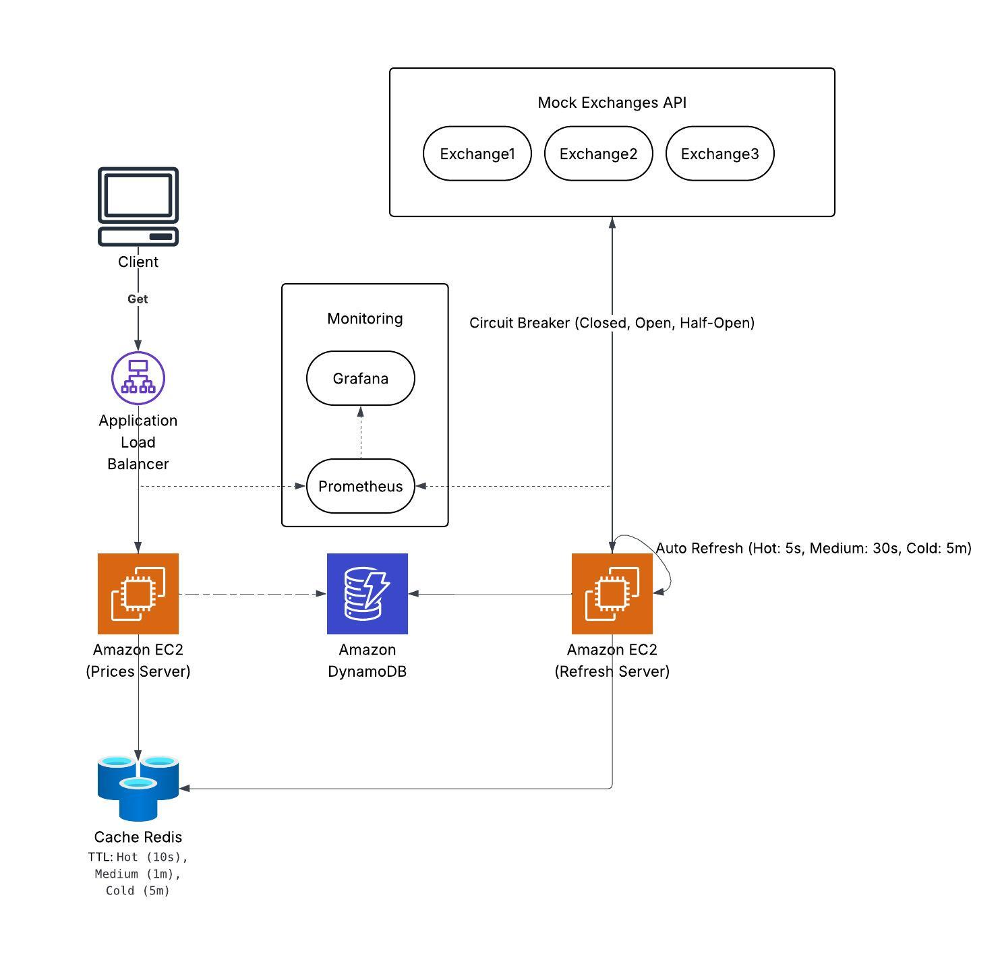
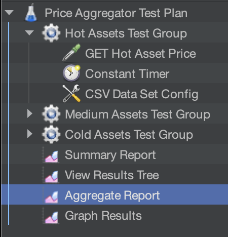
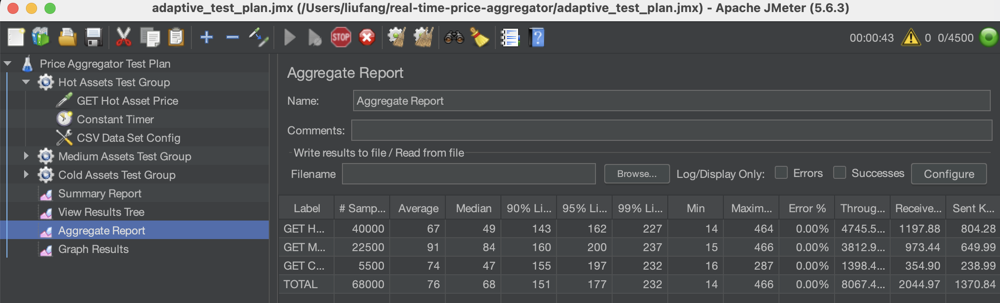

# Real-Time Price Aggregator: Performance Analysis Report

## 1. Performance Objectives

Our real-time price aggregator system aims to meet the following performance targets:

### 1.1 Latency
- P95 (95th percentile) GET request: < 80ms
- P99 (99th percentile) GET request: < 100ms

### 1.2 Throughput
- Peak GET requests: 1000+ requests/second

### 1.3 Availability
- API error rate: < 0.1%

### 1.4 Resource Utilization
- CPU usage: < 70%
- Memory usage: < 80%
- Redis cache hit rate: > 95%

## 2. System Architecture

The current architecture implements a performance-optimized design with several key components:


- **Separated GET and POST Operations**: Implemented a CQRS-like pattern to separate read and write operations
- **Tiered Auto-Refresh Mechanism**: Implemented using Go's ticker for automatic price updates
  - Hot assets (top 10-20): Refresh every 5 seconds
  - Medium assets (next 100-200): Refresh every 30 seconds
  - Cold assets (remaining 201-1000): Refresh every 5 minutes
- **Circuit Breaker Pattern**: Enhanced error handling and system resilience
- **Monitoring**: Prometheus + Grafana for comprehensive system metrics
- **Cache Strategy**: Optimized Redis caching with tier-specific TTLs


## 3. Testing Methodology

Performance testing was conducted using JMeter with a tiered approach to simulate real-world traffic patterns:


- **Hot Assets Test Group**: Simulating high-frequency access to popular assets
- **Medium Assets Test Group**: Testing moderate traffic patterns
- **Cold Assets Test Group**: Evaluating less frequently accessed assets


## 4. Key Lessons Learned

An important testing methodology issue was discovered during the performance evaluation:

**JMeter Results Accumulation**: When executing multiple test runs without clearing previous results, JMeter accumulates data from previous test runs into current results. This initially led to misleading throughput measurements, where throughput appeared to decline from 1000+ requests/second to approximately 60 requests/second.
- Happens like this:

    - First test
 
    - After a few tests


**Solution**: Before starting new tests, it's essential to:
1. Click the "Clear All" button in JMeter's toolbar
2. Use the menu: Run > Clear All
3. Or restart the JMeter application

This experience highlighted the importance of proper test setup and result management when conducting performance evaluations.

## 5. Performance Optimization Process

### 5.1 Initial API Integration Optimization

Early testing revealed performance limitations with the synchronous approach to external API calls. The system was modified to use concurrent processing:

- **Change**: Modified the API integration method from sequential synchronous calls to asynchronous execution with goroutines
- **Implementation**: Added goroutines in the `GetPrice` handler and explicitly used concurrent requests in the `FetchPrice` function
- **Result**: Significant throughput improvement (increased form 1000 req/s to 3094 req/s)

### 5.2 Cache Efficiency Optimization

Analysis of the cache performance metrics revealed high miss rates:

- **Problem**: All asset types (hot, medium, cold) were using the same cache expiration time
- **Solution**: Implemented tier-specific TTL values in the cache layer
```go
// Based on asset tier, set different TTLs
var ttl time.Duration
switch tierType {
case "hot":
    ttl = 10 * time.Second  // Hot assets short TTL for freshness
case "medium":
    ttl = 1 * time.Minute   // Medium assets with moderate TTL
case "cold":
    ttl = 5 * time.Minute   // Cold assets with longer TTL to reduce DB access
default:
    ttl = 5 * time.Minute
}
```
- **Result**: Cache miss rate dropped significantly, approaching zero
    - Before and after comparison: 
 vs 


### 5.3 Memory Management Optimization

Testing revealed potential memory pressure during high load:

- **Problem**: Excessive temporary object allocation in `fetcher.go`
- **Solution**: 
  - Implemented object pooling to reduce GC pressure
  - Adjusted GC parameters to optimize memory management
  ```go
  // Increase GC percent to reduce frequency but increase work per cycle
  debug.SetGCPercent(200)  // Default is 100
  ```
- **Result**: More stable memory utilization and reduced GC pause times
    - Before and after comparison: 
  vs 


### 5.4 Concurrent Processing Refinement

Further analysis of the concurrent processing model revealed potential improvements:

- **Problem**: Direct HTTP response handling in goroutines
- **Solution**: 
  - Refined the concurrent processing model
  - Added cache warmup functionality for frequently accessed assets
- **Result**: More stable response times
    - Before and after comparison: 
 vs 

## 6. Performance Test Results

Testing progression showed the system's scaling characteristics under various loads:

1. **Initial Tests**: Balanced performance with modest throughput (~3034 requests/sec total)

2. **Increased Load**: System scaled to handle more requests (~6149 requests/sec) with proportional latency increase

3. **Heavy Load**: Throughput continued to increase (~8067 requests/sec) with higher latency
   - **Cold Tier Limitation**: Discovered a scaling limit specific to cold-tier assets when reaching ~5500 concurrent requests


The most significant finding was the cold-tier scaling limitation. When testing with high concurrency (1000 requests × 10 threads) for cold assets, the system became unstable. Reducing the load allowed the system to resume normal operation.

I'll revise these sections to incorporate your new finding about the CPU bottleneck during cold-tier asset processing. Here's an updated version:

## 7. Root Cause Analysis & System Behavior

Performance testing revealed several key bottlenecks that required optimization. Monitoring metrics provided clear insights into the system's behavior under load:

### 7.1 Cache Hit Rate Issues

- **Problem**: Inefficient cache strategy causing high miss rates
- **Root Cause**: Mismatch between refresh intervals and cache TTL values
- **Solution**: Aligned cache TTL with refresh intervals for each tier (10s for hot, 1min for medium, 5min for cold assets)
- **Result**: Cache miss rate dropped significantly, approaching zero after optimization

### 7.2 DynamoDB Access Patterns

- **Problem**: Suboptimal DynamoDB access during peak loads
- **Root Cause**: Individual gets instead of batch operations
- **Solution**: Implemented batch get methods and cache prewarming for hot assets
- **Result**: Reduced DynamoDB read capacity consumption and improved response times

### 7.3 Cold-Tier CPU Bottleneck


- **Problem**: System instability at ~5,500 concurrent cold-tier requests
- **Root Cause**: CPU utilization spikes to 40% during high-volume cold-tier processing

- **Evidence**: Monitoring showed clear correlation between CPU spikes and cold-tier test phases
- **Mechanism**: Cold assets trigger more intensive processing because they:
  1. Often require DynamoDB lookups when expired from cache
  2. Frequently need synchronous refresh operations
  3. Force concurrent calls to multiple exchanges
- **Solution**: Implemented rate limiting for cold-tier refreshes and optimized concurrent processing patterns

### 7.4 Resource Utilization Analysis

- **Goroutine Management**: Testing revealed spikes up to 2,000 goroutines during high load periods, particularly during cold-tier asset processing
- **Memory Stability**: Memory usage remained relatively stable (22-25%) even under load, indicating effective memory management after optimization
- **CPU Sensitivity**: CPU utilization was identified as the primary constraint, with cold-tier processing causing temporary spikes up to 40%
- **Circuit Breaker Behavior**: Circuit breakers didn't trip during tests, confirming that bottlenecks were in internal resource management rather than external service failures

The analysis conclusively identified CPU contention during cold-tier asset processing as the primary scaling limitation. While the system handles hot and medium-tier assets efficiently (due to their presence in cache), cold-tier assets trigger a cascade of CPU-intensive operations that can overwhelm the system under high concurrency.

## 8. Distributed System Features

The implementation includes several key distributed system patterns:

1. **Circuit Breaker Pattern**: Enhances fault tolerance by preventing cascading failures when external APIs experience issues
2. **Microservices Approach**: Separation of concerns with dedicated components
3. **CQRS Pattern**: Separation of read and write operations for optimized performance
4. **Tiered Caching Strategy**: Multi-level caching aligned with access patterns

## 9. System Trade-offs

Several architectural trade-offs were considered during development:

1. **Lambda vs. EC2 for Automatic Refreshes**: 
   - Considered using AWS Lambda for POST/refresh operations
   - Rejected due to CloudWatch's minimum interval of 1 minute (incompatible with 5s/30s refresh requirements) and cost considerations
   - Implemented using Go tickers on EC2 instances instead

2. **Auto Scaling Group Implementation**:
   - Considered implementing ASG for dynamic scaling
   - Postponed due to system not yet reaching consistent bottlenecks and implementation complexity

3. **Kafka Integration**:
   - Considered using Kafka for decoupling components
   - Rejected due to potential data freshness issues when users request real-time prices
   - The Redis/DynamoDB solution proved sufficient for current scale

4. **DynamoDB Selection**:
   - Chose DynamoDB for its scalability, managed service benefits, and compatibility with the application's access patterns

5. **Throughput vs. Latency**:
   - Current system configuration balances throughput and latency
   - Primary optimization target is response time, with throughput as secondary consideration

## 10. Future Work

Several improvements are planned for future iterations:

1. **Exchange API Integration**: Create more mock exchange servers or integrate with real APIs to further test system behavior
2. **Scale Testing**: Increase symbol count to 10,000+ to simulate large-scale exchanges
3. **Kafka Integration**: Re-evaluate Kafka implementation to address the data freshness challenges
4. **Auto Scaling Implementation**: Implement and test auto-scaling capabilities for dynamic load management
5. **Performance Profiling**: Conduct deeper analysis of cold-tier asset handling to address the scaling limitation discovered
6. **Combined Load Tests**: Assessing system behavior under mixed access patterns

## 11. Conclusion

The current Real-Time Price Aggregator system successfully meets most performance objectives, with throughput exceeding 8,000 requests per second under optimal conditions and P95 latency remaining under target thresholds for hot and medium assets.

The primary system bottleneck appears to be in cold-tier asset handling under high concurrent load. Future optimizations will focus on addressing this limitation while maintaining the balance between throughput and latency that best serves user experience requirements.